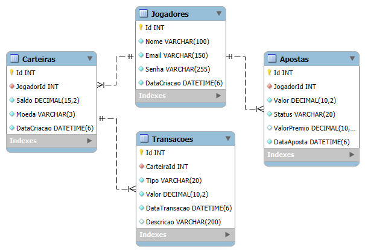
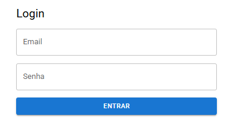
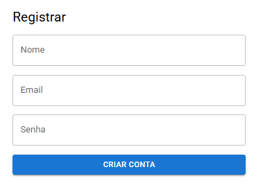
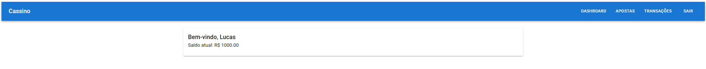
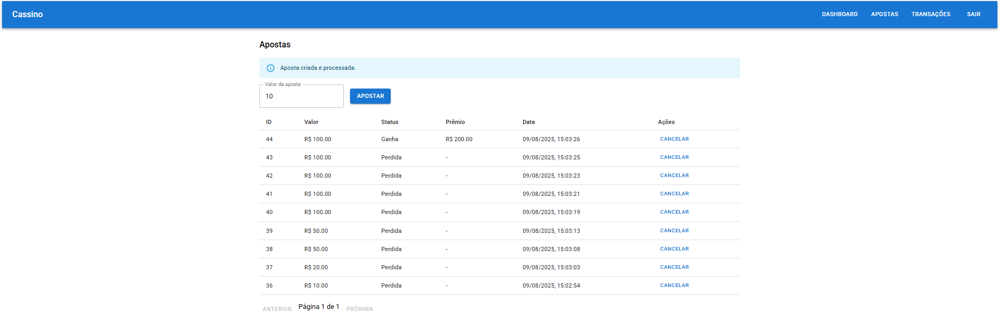
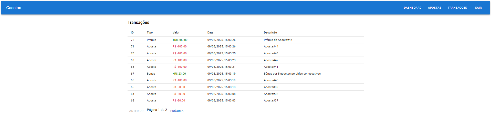

# API Cassino - Sistema de Apostas Online

Sistema completo de apostas online desenvolvido em **.NET 6** com **Entity Framework Core** e **Swagger**, **MySQL** e arquitetura baseada em **Clean Architecture** com **Repository Pattern** e testes unitários abrangentes; e **React** para o front-end do sistema.


---

## Índice

- [Características](#-características)
- [Arquitetura](#️-arquitetura)
- [Modelo Entidade Relacional (MER)](#-modelo-entidade-relacional-mer)
- [Como Executar](#-como-executar)
  - [Configurar Banco de Dados](#1-configurar-banco-de-dados)
  - [Controle de Migrations](#2-controle-de-migrations)
  - [Executar Testes](#3-executar-testes)
  - [Executar API](#4-executar-api)
  - [Executar o Frontend](#5-executar-o-frontend)
- [Screenshots da Interface](#screenshots-da-interface)

---

## Características

- **Sistema de apostas** com 30% de chance de vitória
- **Saldo inicial** de R$ 1.000 para novos jogadores
- **Sistema de bônus** por 5 apostas perdidas consecutivas
- **Cancelamento flexível** de apostas (ganha ou perdida)
- **Histórico completo** de transações paginado
- **18 testes unitários** com 100% de aprovação
- **Clean Architecture** com Repository Pattern
- **Docker** para ambiente de desenvolvimento
- **Documentação** com Swagger

---

## Arquitetura

O projeto segue os princípios da **Clean Architecture** e **SOLID**, utilizando:
<pre>
┌─────────────────┐    ┌─────────────────┐    ┌─────────────────┐
│   Controllers   │──▶│    Services      │──▶│  Repositories   │
│  (API Layer)    │    │ (Business Logic)│    │  (Data Access)  │
└─────────────────┘    └─────────────────┘    └─────────────────┘
         │                        │                        │
         ▼                        ▼                        ▼
┌─────────────────┐    ┌─────────────────┐    ┌─────────────────┐
│      DTOs       │    │   Interfaces    │    │  Entity Models  │
│ (Data Transfer) │    │ (Abstractions)  │    │  (Domain)       │
└─────────────────┘    └─────────────────┘    └─────────────────┘
</pre>

---

### Padrão Repository

O projeto segue o **Repository Pattern** dentro da **Clean Architecture**, criando uma camada de abstração entre a lógica de negócio e o acesso a dados.  
Isso garante **desacoplamento**, **testabilidade** e **flexibilidade** para trocar a tecnologia de persistência no futuro.

### **Camadas da Aplicação:**

- **Controllers**: Endpoints REST, validação de entrada, mapeamento de responses
- **Services**: Regras de negócio, cálculos, orquestração de operações
- **Repositories**: Abstração do acesso a dados, implementação com Entity Framework
- **Models**: Entidades de domínio, mapeamento para banco de dados
- **DTOs**: Objetos de transferência

---

## Modelo Entidade Relacional (MER)



---

## Como Executar

### **Pré-requisitos**
- [.NET 6 SDK](https://dotnet.microsoft.com/download/dotnet/6.0)
- [Docker](https://www.docker.com/get-started)
- [MySQL Workbench](https://dev.mysql.com/downloads/workbench/) (opcional)

### **1. Configurar Banco de Dados**

```bash
# Navegar até a pasta com o arquivo docker-compose.yml
cd src/ApiCassino

# Subir o container MySQL em segundo plano (modo detached)
docker compose up -d

# Verificar se o container está rodando (buscar por uma mysql)
docker ps
```

### **2. Controle de Migrations**

O projeto usa **Entity Framework Core Migrations** para versionar e aplicar alterações no banco de dados.

#### Executar Migrations
```bash
# Navegar até o projeto principal
cd src/ApiCassino

# Restaurar dependências
dotnet restore

# Aplicar todas as migrations pendentes
dotnet ef database update
```

#### Criar Nova Migration
```bash
# Criar migration para mudanças no modelo
dotnet ef migrations add [NomeDaMigration]

# Exemplo:
dotnet ef migrations add AddUltimoLoginToJogadores
```

#### Reverter Migration
```bash
# Voltar para migration anterior
dotnet ef database update [NomeDaMigrationAnterior]

# Exemplo: voltar para estado inicial
dotnet ef database update InitialCreate
```

#### Remover Última Migration
```bash
dotnet ef migrations remove
```

### **3. Executar Testes**

```bash
# Ver toda a lista de testes
dotnet test tests/ApiCassino.Tests --list-tests

# Rodar os testes (nível de verbosidade normal)
dotnet test tests/ApiCassino.Tests --verbosity normal

# Rodar os testes com relatório detalhado no console
dotnet test tests/ApiCassino.Tests --logger "console;verbosity=detailed"
```

#### **Cobertura de Testes**

<pre>
| Componente       | Testes  | Cenários Cobertos                     | Status |
|------------------|---------|---------------------------------------|--------|
| AuthController   | 10      | Registro, Login, Validações completas |   ✅   |
| ApostaService    | 4       | Regras de negócio e validações        |   ✅   |
| TransacaoService | 3       | Operações financeiras                 |   ✅   |
| Total            | 18      | Cobertura abrangente                  |   ✅   |
</pre>

#### Cenários Testados

##### **Regras de Negócio**
- Valor mínimo de aposta (**R$ 1,00**)
- Saldo suficiente antes de apostar
- Saldo inicial de **R$ 1.000** para novos jogadores
- Cancelamento flexível de apostas
- Transações financeiras com valores corretos

##### **Validações**
- Email único no sistema
- Campos obrigatórios em todos os endpoints
- Formatos válidos (email, senha)
- Tratamento de dados nulos
- Casos de erro bem definidos

### **4. Executar API**

```bash
# Executar em modo desenvolvimento com hot reload
dotnet run --project src/ApiCassino

# Ou buildar o projeto e depois executar
dotnet build src/ApiCassino
dotnet run --project src/ApiCassino
```

---

## Endpoints da API

**Base URL:** `https://localhost:7297/api`

---

### 1. Autenticação (`/auth`)

#### **Registrar Novo Jogador**
**POST** `/auth/register`  
O que faz: Cria conta de um novo jogador no sistema  
Como usar: Enviar nome, email e senha  

```json
// O que você manda:
{
  "nome": "João Silva",
  "email": "joao@email.com", 
  "senha": "123456"
}

// O que você recebe:
{
  "id": 1,
  "nome": "João Silva",
  "email": "joao@email.com",
  "saldoCarteira": 1000.00,  // ← Sempre R$ 1000 de bônus inicial!
  "dataCriacao": "2024-08-09T13:14:15.123Z"
}
```

#### **Fazer Login**
**POST** `/auth/login`
O que faz: Entra no sistema com email e senha  
Como usar: Enviar credenciais para autenticar

```json
// O que você manda:
{
  "email": "joao@email.com",
  "senha": "123456"
}

// O que você recebe:
{
  "id": 1,
  "nome": "João Silva",
  "saldoCarteira": 750.00,  // ← Saldo atual (pode ter mudado)
  "dataCriacao": "2024-08-09T13:14:15.123Z"
}
```

## 2. Apostas (/apostas)

#### **Fazer uma Aposta**
**POST** `/apostas/jogador/{jogadorId}`
O que faz: Cria uma nova aposta e já calcula o resultado na hora  
Como funciona: Sistema decide automaticamente se você ganhou ou perdeu

```json
// O que você manda:
{
  "valor": 50.00
}

// Se GANHOU (30% de chance):
{
  "id": 1,
  "valor": 50.00,
  "status": "Ganha",
  "valorPremio": 100.00,  // ← Dobrou seu dinheiro!
  "dataAposta": "2024-08-09T13:15:00Z",
  "nomeJogador": "João Silva"
}

// Se PERDEU (70% de chance):
{
  "id": 2,
  "valor": 50.00,
  "status": "Perdida",
  "valorPremio": null,    // ← Perdeu o dinheiro
  "dataAposta": "2024-08-09T13:16:00Z",
  "nomeJogador": "João Silva"
}
```

#### **Ver Minhas Apostas**
**GET** `/apostas/jogador/{jogadorId}?page=1&pageSize=10`
O que faz: Lista todas as suas apostas (com paginação)  
Como usar: Passar o ID do jogador e opcionalmente page/pageSize

#### **Cancelar uma Aposta**
**PUT** `/apostas/{apostaId}/cancelar/{jogadorId}`
O que faz: Cancela uma aposta e devolve o dinheiro (respeitando as regras)  
Como usar: Passar ID da aposta e do jogador

## 3. Transações (/transacoes)
#### **Ver Histórico Financeiro**
**GET** `/transacoes/jogador/{jogadorId}?page=1&pageSize=10`
O que faz: Mostra todas as movimentações de dinheiro  
Como usar: Passar ID do jogador para ver o extrato

```json
// Exemplo do que você recebe:
{
  "data": [
    {
      "tipo": "Aposta",
      "valor": -50.00,        // ← Saiu dinheiro (negativo)
      "descricao": "Aposta#1"
    },
    {
      "tipo": "Premio", 
      "valor": 100.00,        // ← Entrou dinheiro (positivo)
      "descricao": "Prêmio da Aposta#1"
    },
    {
      "tipo": "Bonus",
      "valor": 25.00,         // ← Bônus por perder muito
      "descricao": "Bônus por 5 apostas perdidas consecutivas"
    }
  ],
  "totalCount": 15,
  "page": 1,
  "pageSize": 10
}
```

---

### **5. Executar o Frontend**

#### Clonar repositório e Instalar dependências

```bash
git clone https://github.com/Luisguiv/CassinoFront
cd cassino-frontend

npm install
```

#### Configurar variáveis de ambiente
```bash
cp .env.example .env
```

Editar .env com URL da API: `VITE_API_BASE_URL=https://localhost:7297`

#### Executar em desenvolvimento
```bash
npm start
```

## Screenshots da Interface

### **Sistema de Autenticação**

<div align="center">

 | 
:---:|:---:
**Login** | **Registro**

</div>

---

### **Tela Principal - Dashboard**



---

### **Interface de Apostas**



---

### **Interface de Transações**



---
